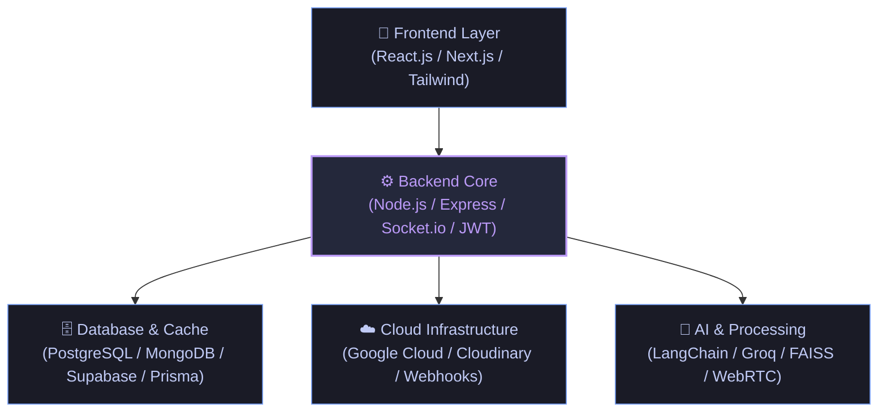

<!-- Visitor Counter -->
<p align="right">
  
</p>

<!-- BANNER & LOGO -->
<p align="center">
  
</p>

<p align="center">
  
</p>

<!-- HEADER -->
<h1 align="center">
  Hi, I'm Karthik Chakala 
</h1>

<p align="center">
  
</p>

<p align="center">
  <b>CS Undergraduate at IIIT Kurnool | Building Scalable, Secure Web Systems & AI-Driven Microservices</b>
</p>

<p align="center">
  
  
</p>

<!-- QUICK ACTION BUTTONS -->
<p align="center">
  <a href="https://karthik-chakala.vercel.app/" target="_blank">
    
  </a>
  <a href="https://drive.google.com/file/d/1zzKfULL6rt6XdqKQb1eHAlDAoj_kN2h4/view?usp=drive_link" target="_blank">
    
  </a>
  <a href="mailto:karthikc11105@gmail.com">
    
  </a>
  <a href="https://www.linkedin.com/in/chakala-karthik-5a9695378/" target="_blank">
    
  </a>
</p>

<hr />

<!-- ABOUT ME -->
### 👤 About Me

I am a Computer Science undergraduate student at **IIIT Kurnool** with a strong foundation in full-stack web development, backend engineering, and AI applications. As an SDE intern candidate, I enjoy designing secure client-server architectures, building real-time microservices, and developing AI-driven components. Through coursework, personal projects, and competitive programming, I am committed to writing clean, maintainable code and solving complex structural problems.

---

### 💻 Engineering Expertise

Instead of just tools, here are the core software engineering capabilities I bring to the table:

*   **Backend & APIs:** Designing and optimizing rate-limited RESTful endpoints (Express/Node) integrated with structured Winston/Morgan logging.
*   **Authentication & Security:** Implementing token-based security workflows via JWT and OAuth protocols.
*   **Real-Time Systems:** Creating bi-directional state synchronization using Socket.IO and peer-to-peer audio/video streaming via WebRTC.
*   **Database Design:** Structuring relational (PostgreSQL, MySQL) and NoSQL (MongoDB) schemas, enforcing referential integrity with constraints/triggers.
*   **AI Pipelines:** Orchestrating intelligent services including vector-based retrieval (FAISS), LangChain processing, and AI integrations (Groq API).

---

### 🎨 Architecture Overview

This diagram represents the typical architectural flow of my full-stack applications, detailing how information routes from frontend clients down to cloud and AI services:



<hr />

<!-- FEATURED PROJECTS -->
### 🚀 Featured Projects

<table width="100%">
  <tr>
    <td width="100%" valign="top">
      <h3>🚜 Farm to Home</h3>
      <p><b>Hyperlocal Agri-Commerce Platform</b></p>
      <p>A microservices-based commerce platform connecting local farmers directly with consumers within a 5–7 km radius using location-aware distance filtering.</p>
      <p><b>Tech Stack:</b> React.js, Node.js, Express.js, Supabase, Socket.IO, WebRTC, Node-Cron, Razorpay</p>
      <p><b>Architecture:</b> Microservices Architecture, Client-Server</p>
      <p><b>Key Features:</b> Live chat & expert consultations via WebRTC/Socket.IO, Winston/Morgan logging, automated billing via Node-Cron & Razorpay, AI suite for pest detection.</p>
      <p>
        <a href="https://github.com/Karthikchakala/FarmToHome" target="_blank">
          
        </a>
      </p>
    </td>
  </tr>
  <tr>
    <td width="100%" valign="top">
      <h3>🏥 Hospital Management System</h3>
      <p><b>Full-Lifecycle Healthcare Application</b></p>
      <p>A comprehensive hospital management platform streamlining appointment booking, EMR, laboratory, pharmacy, and billing operations.</p>
      <p><b>Tech Stack:</b> Next.js, React.js, Node.js, Express.js, Supabase, Cloudinary, Multer, Nodemailer, Razorpay</p>
      <p><b>Architecture:</b> MVC, Client-Server</p>
      <p><b>Key Features:</b> Lead a 4-member Agile team, delivered 30+ role-based REST APIs, token-based JWT authentication, integrated Cloudinary and Razorpay.</p>
      <p>
        <a href="https://github.com/Karthikchakala/HospitalManagement" target="_blank">
          
        </a>
      </p>
    </td>
  </tr>
  <tr>
    <td width="100%" valign="top">
      <h3>📚 E-Learning Platform</h3>
      <p><b>Scalable Online Learning Management System</b></p>
      <p>An online academy offering course delivery, live competitive quizzes, and payment integrations with role-based access control.</p>
      <p><b>Tech Stack:</b> React.js, Node.js, Express.js, PostgreSQL, Supabase, Socket.IO</p>
      <p><b>Architecture:</b> Monolithic Client-Server, Namespace-based Event Routing</p>
      <p><b>Key Features:</b> Live quizzes via Socket.IO namespaces, HMAC webhook verification, 40+ REST endpoints, robust PostgreSQL triggers & constraints.</p>
      <p>
        <a href="https://github.com/Karthikchakala/course-mgmt-sys" target="_blank">
          
        </a>
      </p>
    </td>
  </tr>
  <tr>
    <td width="100%" valign="top">
      <h3>💻 Personal Portfolio</h3>
      <p><b>Interactive Developer Portfolio</b></p>
      <p>A personal portfolio site showcase highlighting technical expertise, projects, and educational credentials.</p>
      <p><b>Tech Stack:</b> HTML5, CSS3, JavaScript, Vercel</p>
      <p><b>Architecture:</b> SPA Client-Server</p>
      <p><b>Key Features:</b> Clean responsive interface, performance-optimized, hosted on Vercel.</p>
      <p>
        <a href="https://github.com/Karthikchakala/my-portfolio" target="_blank">
          
        </a>
        <a href="https://karthik-chakala.vercel.app/" target="_blank">
          
        </a>
      </p>
    </td>
  </tr>
  <tr>
    <td width="100%" valign="top">
      <h3>🧵 StitchEase</h3>
      <p><b>Smart Tailoring Service Platform (In Progress)</b></p>
      <p>A comprehensive web-based platform modernizing traditional tailoring services by connecting customers, tailors, delivery agents, and administrators on a single digital platform.</p>
      <p><b>Tech Stack:</b> React.js, Node.js, Express.js, PostgreSQL, Supabase, Socket.IO, Razorpay, Tailwind CSS</p>
      <p><b>Architecture:</b> Three-tier Marketplace Model, Client-Server</p>
      <p><b>Key Features:</b> Body measurement profiles, custom design uploads, visual progress timeline with stage photo updates, real-time tailor-customer chat, and role-based access control.</p>
      <p>
        <a href="https://github.com/Karthikchakala" target="_blank">
          
        </a>
      </p>
    </td>
  </tr>
  <tr>
    <td width="100%" valign="top">
      <h3>📸 Image & Video Steganography</h3>
      <p><b>Deep Video Steganography in Cover Videos</b></p>
      <p>A deep learning-based steganography system that hides secret videos inside cover videos using convolutional neural networks.</p>
      <p><b>Tech Stack:</b> Python, TensorFlow, Keras, OpenCV, NumPy, scikit-image, imageio, matplotlib</p>
      <p><b>Architecture:</b> Autoencoder-based Neural Network (Prepare, Hide, and Reveal Networks)</p>
      <p><b>Key Features:</b> Double-network simultaneous training (weighted L2 loss), permutation-based block shuffling (56x56 keys), and non-local means denoising/sharpening enhancements.</p>
      <p>
        <a href="https://github.com/Karthikchakala/Image-Steganography" target="_blank">
          
        </a>
      </p>
    </td>
  </tr>
</table>

<hr />

<!-- TECH STACK -->
### 🛠️ Technical Skills

#### 💻 Programming Languages
<p align="left">
  
  
  
  
</p>

#### 🎨 Frontend Development
<p align="left">
  
  
  
  
  
  
</p>
<blockquote>
  <b>Core Concepts:</b> Responsive Design • Component Architecture • State Management
</blockquote>

#### ⚙️ Backend Development
<p align="left">
  
  
  
  
  
  
  
</p>
<blockquote>
  <b>Core Concepts:</b> REST API Development • API Design • Asynchronous Programming • Middleware Development
</blockquote>

#### 🗄️ Databases & Cloud Storage
<p align="left">
  
  
  
  
  
  
  
  
  
  
</p>
<blockquote>
  <b>Core Concepts:</b> Database Design • SQL • NoSQL • Query Optimization
</blockquote>

#### 🤖 AI & LLM
<p align="left">
  
  
  
</p>
<blockquote>
  <b>Core Concepts:</b> Retrieval-Augmented Generation (RAG) • Prompt Engineering • Vector Databases • Semantic Search • LLM Integration • AI API Integration
</blockquote>

#### ☁️ Cloud Computing
<p align="left">
  
</p>
<blockquote>
  <b>Core Concepts:</b> Cloud Computing Fundamentals • Cloud Storage Concepts • Cloud-Based Application Development • Cloud Deployment Basics
</blockquote>

#### 🏗️ System Design
<blockquote>
  <b>Conceptual Knowledge (Acquired through coursework, projects, and self-learning):</b><br>
  High-Level Design (HLD) • Low-Level Design (LLD) • System Design Fundamentals • Scalable Backend Architecture • Database Design • API Design • Client-Server Architecture • Distributed Systems Fundamentals
</blockquote>

#### 🚀 Software Engineering
<blockquote>
  <b>Core Competencies:</b><br>
  Object-Oriented Programming (OOP) • Data Structures & Algorithms • Problem Solving • Debugging • Clean Code Practices • Software Design Principles (SOLID) • Design Patterns • Software Development Life Cycle (SDLC) • Agile Methodology • Performance Optimization • Version Control • Code Review Practices
</blockquote>

#### 🛠️ DevOps & Tools
<p align="left">
  
  
  
  
  
  
  
  
  
  
  
</p>

---

### 🎯 Current Focus & Learning

<table width="100%">
  <tr>
    <td width="50%" valign="top">
      <h4>🔥 Currently Working On</h4>
      <ul>
        <li><b>AI Agents & LLM Architectures:</b> Integrating LangChain workflows and vector search engines.</li>
        <li><b>Scalable API Backend:</b> Developing microservices using Node.js and REST standards.</li>
        <li><b>RAG Applications:</b> Implementing optimized document retrieval systems using Vector Databases.</li>
        <li><b>System Design Foundations:</b> Researching clean architectural design patterns (HLD/LLD).</li>
      </ul>
    </td>
    <td width="50%" valign="top">
      <h4>📚 Currently Learning</h4>
      <ul>
        <li><b>Advanced AI Models:</b> Graph Neural Networks (GNNs) and Generative Adversarial Networks (GANs).</li>
        <li><b>Distributed Systems:</b> Deep-diving into replication, consensus, and scalability fundamentals.</li>
        <li><b>Google Cloud Platform:</b> Exploring cloud deployments, storage integration, and Serverless.</li>
      </ul>
    </td>
  </tr>
</table>

---

### 📅 Engineering Timeline

```
  [2023]  Started Programming & Data Structures foundations in C++ (LeetCode 1600+ rating)
    │
  [2024]  Mastered Object-Oriented Programming (Java) and transitioned to Frontend Web Development
    │
  [2025]  Engineered complex backend APIs, transactional SQL workflows, and real-time state synchronization
    │
  [2026]  Deployed full-lifecycle software applications (HMS, Farm to Home, E-Learning) with AI integration
    │
  [Present] Exploring Advanced System Design, Cloud Deployments, and Intelligent AI Orchestration
```

<hr />

<!-- EDUCATION, ACHIEVEMENTS & CERTIFICATIONS -->
### 🎓 Education & Credentials

#### 🏛️ Education
* **Indian Institute of Information Technology (IIIT), Kurnool** <br> _B.Tech in Computer Science and Engineering (2023 – 2027)_ | **CGPA: 8.4 / 10**
  * *Relevant Coursework:* Data Structures and Algorithms, Database Management Systems, Operating Systems, Computer Networks, Object-Oriented Programming
* **Amaravathi Jr College** <br> _MPC_ | **JEE Percentile: 97.4%**

#### 🏆 Competitive Programming & DSA
* **LeetCode:** Rating 1600+ | 300+ problems solved across LeetCode & GeeksforGeeks
* **CodeChef:** 3★ (3-Star) | Competed in 20+ rated contests

#### 📜 Certifications
* **Cloud Computing:** NPTEL (Elite Certificate | Score: **82%** | Roll No: `NPTEL26CS55S1050600341`)
* **Python, C, Linux:** IIT Bombay Certificate
* **Cloud Computing Fundamentals:** NPTEL Course Certificate

---

### 📊 GitHub Statistics

<p align="center">
  
  
</p>

<p align="center">
  
</p>

<p align="center">
  
</p>

<hr />

<!-- OPEN TO WORK -->
### 💼 Open to Opportunities

I am actively seeking **SDE Intern** roles and **Software Engineering** opportunities focusing on:
*   Backend Engineering / API Development
*   Full Stack Development (React.js, Next.js, Node.js)
*   AI Engineering & LLM Integrations
*   Cloud & DevOps Systems
*   Contributing to Open Source Systems

---

<!-- CONTACT -->
### 🤝 Let's Connect

<p align="center">
  <a href="https://karthik-chakala.vercel.app/" target="_blank">
    
  </a>
  <a href="https://github.com/Karthikchakala" target="_blank">
    
  </a>
  <a href="https://www.linkedin.com/in/chakala-karthik-5a9695378/" target="_blank">
    
  </a>
  <a href="https://www.instagram.com/karthik_chakala/" target="_blank">
    
  </a>
  <a href="mailto:karthikc11105@gmail.com">
    
  </a>
  <a href="https://drive.google.com/file/d/1zzKfULL6rt6XdqKQb1eHAlDAoj_kN2h4/view?usp=drive_link" target="_blank">
    
  </a>
</p>
